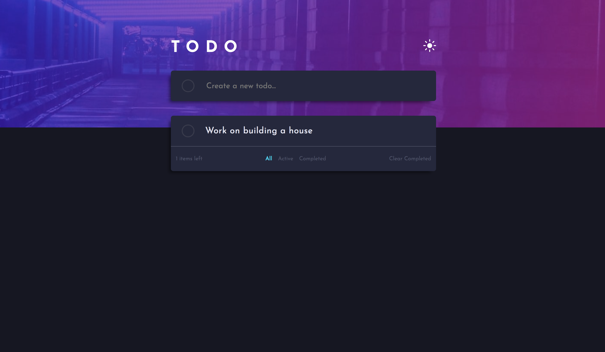

# Frontend Mentor - Todo app solution

This is a solution to the [Todo app challenge on Frontend Mentor](https://www.frontendmentor.io/challenges/todo-app-Su1_KokOW).

## Table of contents

- [Overview](#overview)
  - [The challenge](#the-challenge)
  - [Screenshot](#screenshot)
  - [Links](#links)
- [My process](#my-process)
  - [Built with](#built-with)
  - [What I learned](#what-i-learned)
- [Author](#author)

**Note: Delete this note and update the table of contents based on what sections you keep.**

## Overview

### The challenge

Users should be able to:

- View the optimal layout for the app depending on their device's screen size
- See hover states for all interactive elements on the page
- Add new todos to the list
- Mark todos as complete
- Delete todos from the list
- Filter by all/active/complete todos
- Clear all completed todos
- Toggle light and dark mode
- **Bonus**: Drag and drop to reorder items on the list

### Screenshot

### Links

- Solution URL: [https://www.frontendmentor.io/solutions/to-do-app-using-reactredux-with-nodejs-and-mongodb-lnr9jPg7p](https://www.frontendmentor.io/solutions/to-do-app-using-reactredux-with-nodejs-and-mongodb-lnr9jPg7p)
- Live Site URL: [https://fm-todo-app.herokuapp.com/](https://fm-todo-app.herokuapp.com/)

## My process

### Built with

- Semantic HTML5 markup
- SASS
- Flexbox
- Mobile-first workflow
- [React](https://reactjs.org/) - React JS library for Front End
- Redux
- NodeJS with Express for the backend
- MongoDB database with Mongoose

### What I learned

I learned how to setup a backend with Nodejs and Expressjs and create many diffrent routes that would allow me to create an API that I would be able to use in the Front End. I got familiar with MongoDB and was able to implement it on the backend with Mongoose.

For the Front end I leveraged React with Redux to manage the data. Using Redux allowed me to tap into the APIs I created in the backend and rerender componets as needed. I used both class based components and functional components with Hooks. 

I used gitHub for the repo and Heroku to host the app. Learned how to implement ENVIROMENT VARIABLES for secret keys with Heroku and node. Was able to deploy the app by connecting Heroku to the git repo branch.

## Author

- Frontend Mentor - [@anayafj](https://www.frontendmentor.io/profile/anayafj)
